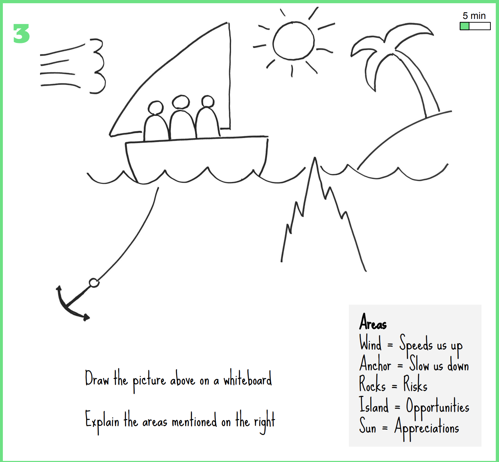

# Retrospective script - Sailboat

The purpose of this, and every retrospective, is to help us to improve by coming up with a few concrete improvement actions that we can complete / test / do until the next retrospective.  Small, concrete actions are preferred before large lofty goals that we don't reach anytime soon. There will be another retrospective in a few weeks.

This particular retrospective is a very visual way of finding our improvement actions. You will need a big piece of paper or preferrably a whiteboard. And some post-its.

This retrospective takes about 45 minutes

## Preparations

You could do this as part of the retrospective but I find it will be sloppy and I get nervous doing it in front of people.

You could also print  and use that as your template

* Draw a sailboat in the middle of the whiteboard
* Add wind to represent the things that push us on
* Add some rocks under the water to represent dangerous scary stuff that might sink us
* Add a deployed anchor that is holding / slowing us down
* Add a gazing sun that represents the things that we are appreciating
* Finally add an island the potential or

## Review (5 min)

- Read the previous improvment actions
- Did we do them?
  - If no - why not?
  - If yes - what happened?
- What should we think about writing new action items?

## Generate data (15 min)

* Point to the different parts of the drawing and explain what they represent
  * Use the descriptions above
  * or use this legend
    * Boat - us, the team
    * Wind - speeds us up
    * Anchor - slows us down
    * Rocks - risks
    *  Island - Opportunities
    * Sun - Appreciations
* Ask the participants to add a post-it to whatever area they feel like

## Gather insights (20 min)

* Ask the participants to add their post-its on the board and describe and clarify how they are thinking
* Once everyone is done - group the topics that belongs together
* Now discuss and come up with a few (max 2) action points

## Close retrospective (2 min)

- Thank everyone for participating
- Do a fist-of-five vote for how good the retrospective was
- Ask participants to write, if the want, a post-it on what would make improve their rating
- Bring the action items to your mob station